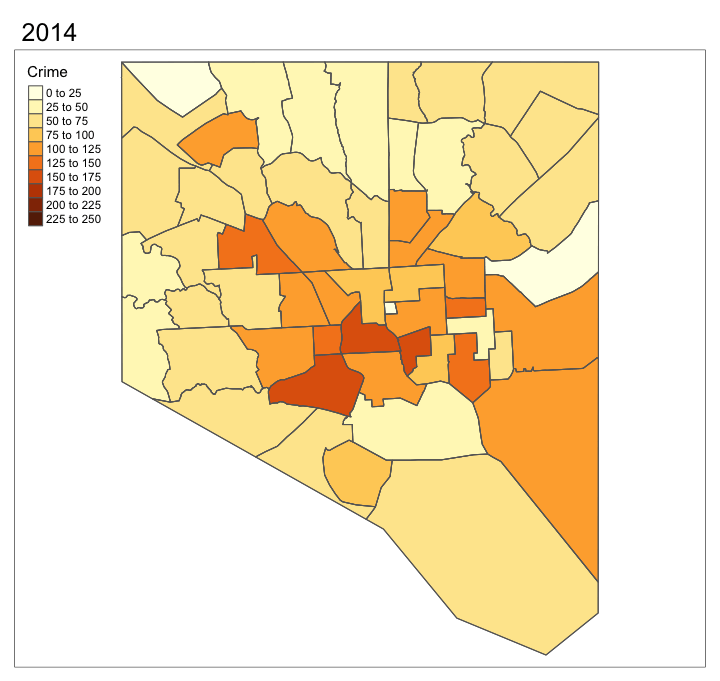

# Exploratory data analysis {.tabset}

```{r, echo = FALSE, message = FALSE, warning = FALSE}
source(here::here("scripts/setup.R"))
```

### 3.1 Calculation of the density of CCTV per community

The  CCTV data set which we retrieved had a slight challenge: although it contained some neighborhood names, most of them were not matching the "standard neighborhood" names. To solve that issue we decided to  involve geospatial counting. 

Our procedure included the following steps. After reading the table and converting the data into a data table, we define what will be the coordinates of the newly created spatial file. Here we have several types of coordinates, we use X and Y which use the EPSG:3857 WGS 84 / Pseudo-Mercator coordinate system. Spatial files must have coordinate systems assigned to them. In the case at hand, we will work with the above mentioned EPSG:3857 WGS 84 / Pseudo-Mercator coordinate system for all the spatial files that we are going to use. Therefore, to ensure consistency, we create a crs object called `crs.geo1` that is going to be assigned to all the spatial files we will use. In order to assign a crs to spatial data, we use the `proj4string` function, to which we assign `crs.geo1`.

```{r echo=TRUE}
#read in data table
balt_dat <-
  fread(file = here::here("data/Baltimore_CCTV_Locations_Crime_Cameras.csv"))

#convert to data table
balt_dat <- as.data.table(balt_dat)

#make data spatial
coordinates(balt_dat) <-  c("X", "Y")
crs.geo1 <-
  CRS(
    "+proj=merc +a=6378137 +b=6378137 +lat_ts=0 +lon_0=0 +x_0=0 +y_0=0 +k=1 +units=m +nadgrids=@null +wktext +no_defs +type=crs"
  )
proj4string(balt_dat) <-  crs.geo1  
```

Then, we can use `plot`to quickly visualise the cloud of points which represent all the CCTVs in Baltimore.

```{r}

plot(balt_dat, pch = 20, col = "steelblue") #We can use the plot function to quickly plot the SpatialPointDataFrame that we created. We see a bunch of points which represent the CCTV location in Baltimore.
```

Next, we have to work with a shapefile object which is another special type of file. It basically is a set of polygons which represents different areas of the city of Baltimore. We downloaded this file on the city's open data portal. We read it in and assign to this file our crs.geo1 coordinate system. In this way we ensure that both of our files have the same coordinate system.

```{r echo=TRUE}
#read in shapefile of baltimore
baltimore <-
  readOGR(dsn = here::here("data/Community_Statistical_Area"),
          layer = "Community_Statistical_Area") #name of file and object
proj4string(baltimore) <- crs.geo1
```

Shape file document:<br>
[https://arcg.is/1T4jiK]

We can now plot these two spatial files together to see the spread of CCTVs over the 56 community statistical areas.

```{r echo=TRUE}
#plot
plot(baltimore, main = "The placement seems to follow interesting patterns")
plot(balt_dat,
     pch = 20,
     col = "steelblue" ,
     add = TRUE) #If we plot these two lines together, what we obtain is a map of baltimore, we have the 56 community statistical areas and the CCTVs on top of the map.
```

To illustrate these results numerically, we need R to count for us how many CCTV belongs to which area. Here, the function `over` counts how many CCTVs are layed over a certain polygon frame. We create a new object called `counts` and  make it into a data frame (so that it is easier for us to work with it). We use  `sum` to ensure that we well and truly have 836 observations which were counted. This is the case so we are happy. Still we notice that we only have 41 rows, meaning that only 41 out of 56 areas contain some CCTVs. 

```{r echo=TRUE}
#Perform the count
proj4string(balt_dat)
proj4string(baltimore) #To be able to perform the count, we must ensure that the two spatial files have a similar CRS. This is the case as we attributed these two files "crs.geo1"

res2 <-
  over(balt_dat, baltimore) #This function tells you to which community each CCTV belongs to
counts <- table(res2$community)
counts <- as.data.frame(counts)
colnames(counts)[1] <- "Community"
sum(counts$Freq) #We see that we have 836 observation in total, this is a good sign as our initial CCTV data set contained 836 obesrvations
```

To make that workable, we need to create a new CCTV data frame, from which we just add 0 to each N.A.-location. Lastly, we create a new column with the `mutate` function to calculate the CCTV density which shows the amount of CCTV per area divided by the total amount of CCTV. 

```{r echo=TRUE}
CCTV_per_area <- area_data[2] %>%
  left_join(counts, by = "Community") #One must add the communities where there are no counts i.e no CCTV

CCTV_per_area[is.na(CCTV_per_area)] <- 0

CCTV_per_area <-
  mutate(CCTV_per_area, density_perc = (CCTV_per_area$Freq / (sum(CCTV_per_area$Freq))) *
           100)
```

#### 3.1.1 Mapping of CCTV density

We now want to map CCTV density on the Baltimore map. We first have to use the %in% operator to ensure that the community names that we have in the Baltimore data set are the same as the one we are having in the CCTV per area data set. As this only returns true values that means that it works and is good for further analysis. 

```{r}
library(tmap)
baltimore$community %in% CCTV_per_area$Community
```

Next, we perform a `left_join` between the Baltimore spatial polygons data frame and the CCTV per area data set. To hedge against the different writing styles (once "community" is written with a capital letter and once with a small letter), we use a vector in the end. Finally, we create the map with the `tmap` package. The `tmap` package somehow works as the `ggplot2` package: First, we need to define a shape, it always starts with the `tm_shape` argument, and then you can add with the plus operator as many arguments as you wish. We used the Baltimore shape file, filled it with the density percentage, defined some breaks, set the borders and the finally the layout. 

```{r results='markup'}
baltimore@data <-
  left_join(baltimore@data, CCTV_per_area, by = c('community' = 'Community'))

CCTV_dens_map <-
  tm_shape(baltimore) + tm_fill(
    col = "density_perc",
    title = "CCTV density (in %)",
    breaks = c(0, 1, 2, 3, 4, 5, 6, 7, 8, 9, 10, 11)
  ) + tm_borders(col = "black", alpha = 0.3) + tm_layout(
    inner.margins = 0.1,
    main.title = str_wrap((
      "We tend to have high CCTV density in the city center"
    ), width = 35),
    title.size = 1 ,
    title.position = c("center", "top"),
    legend.outside = T,
    legend.outside.position = "right"
  )

tmap_mode("plot")
CCTV_dens_map
```

One of the very first interesting observation we are in position to derive is that CCTV density seems to be higher in the city center.

### 3.2 Calculation of the crime per capita per community

We want to calculate crime per 1000 inhabitants per community. To achieve that we group the `crime_data_with_areas` data set by community and then use `summarize` which enables us to compute the crime occurence for each area. Then, using the population data, we can divide the crime occurence per area by the number of inhabitants in each area. We finally multiply this by 1000 to obtain the crime per 1000 inhabitants as this value is apparently often used when calculating crime metrics. Again, we added one more row in the calculations because we have no values for the prison. To make sure we made no mistake, we add up the CrimeFrequency column to see whether it equals to 349482. This is the case. We can therefore go further confidently. We also create a data frame called `Community_data` which will contain all the values we compute which concern the communities.

```{r}
CrimeStatsPerArea <- crime_data_with_areas %>%
  group_by(Community) %>%
  summarize(CrimeFrequency = n())

CrimeStatsPerArea <-
  mutate(CrimeStatsPerArea, CrimePer1000inhabitants = ((CrimeStatsPerArea$CrimeFrequency /
                                                          population_data$tpop20) * 1000
  ))

CrimeStatsPerArea <-
  rbind(CrimeStatsPerArea, list("Unassigned -- Jail", 0, 0))  #We have no information about crimes committed in jail, yet, the community statistical area encompass 56 area, including jail. In order to ensure consistency, we must add a 56th observation in this data frame.

sum(CrimeStatsPerArea$CrimeFrequency) #The total sum is 349482, which is what we expect

Community_data <- CrimeStatsPerArea[, -2] %>%
  left_join(CCTV_per_area, by = "Community") %>%
  left_join(poverty_data[, c(2, 7)], by = c("Community" = "CSA2010"))

```

#### 3.2.1 Mapping of crime per capita per community

We want to map  crime per capita per community. The methodology is the same as we did for CCTV density. This time, we use the "quantile" method to create category breaks. We see that crime tends to be higher in the city center.

```{r echo=TRUE}
library(tmap)

baltimore$community %in% CrimeStatsPerArea$Community #We see that we have a perfect match

baltimore@data <-
  left_join(baltimore@data,
            CrimeStatsPerArea,
            by = c('community' = 'Community'))

Crime_per_capita_map <-
  tm_shape(baltimore) + tm_fill(col = "CrimePer1000inhabitants", title =
                                  "Crime (per 1000 inhabitants)", style = "quantile") + tm_borders(col = "black", alpha =
                                                                                                     0.3) + tm_layout(
                                                                                                       inner.margins = 0.1,
                                                                                                       title = "Crime tends to be higher in the city center of Balimore",
                                                                                                       title.size = 1 ,
                                                                                                       title.position = c("center", "top")
                                                                                                     )

tmap_mode("plot")
Crime_per_capita_map
```

#### 3.2.2 Creation of a distorted map

To observe crime per capita per community distribution in Baltimore visually, we decided to use a distorted map. Again, we use the `tmap` package together with the `cartogram_ncont` function which simply distorts the map based on intensity of crime per capita in each community. Concretely, we want to show that the crime per capita is higher in the city center, compared to the suburban areas. This can be shown quite neatly graphically. 

```{r}

Distorted_Crime_map <-
  tm_shape(cartogram_ncont(baltimore, "CrimePer1000inhabitants")) + tm_fill(col = "CrimePer1000inhabitants", title =
                                                                              "Crime (per 1000 inhabitants)", style = "quantile") + tm_borders(col = "black", alpha =
                                                                                                                                                 0.3) + tm_layout(
                                                                                                                                                   inner.margins = 0.1,
                                                                                                                                                   main.title = str_wrap((
                                                                                                                                                     "Crime tends to be higher in the city center of Balimore"
                                                                                                                                                   ), width = 35),
                                                                                                                                                   title.size = 1 ,
                                                                                                                                                   title.position = c("center", "top"),
                                                                                                                                                   legend.outside = T,
                                                                                                                                                   legend.outside.position = "right"
                                                                                                                                                 ) #This map distorts the size of each area depending on their respective crime per capita It is interesting as it enables one to see that higher crime per capita tends to be concentrated in the city center.

tmap_mode("plot")
Distorted_Crime_map
```
<br>

#### 3.2.3 The prison anomaly

One may wonder what this little square with no crime per capita, surrounded by CCTVs in the very center of Baltimore is. It actually is the prison. Zooming on this little square is interesting. In order to create a "sub-map", we create a smaller area using the `st-bbox` function. The values indicated in the function represent the most extreme values on the x-axis and y-axis of the map using the EPSG:3857 WGS 84 / Pseudo-Mercator coordinate system. Then, using `tm_shape` with the new spatial file called `Prison_map` as argument, we create a map in the same way as we have done before. As we want to be able to locate this smaller area in the picture map of Baltimore, we must also create a Baltimore map with a rectangle representing the newly created "sub-area". In order to combine these two maps together, we run the two last lines together and use the `viewport` function. The output is a zoom on the desired area combined with the bigger map having a rectangle over the area which we are looking at and analyzing. The reason why we see so many CCTVs located on the right-hand side of the map is that the main entrance is located there.

```{r}
tmap_mode("plot")

Prison_area <-  st_bbox(
  c(
    xmin = -8529169.92,
    xmax = -8526465.97,
    ymin = 4764196.55,
    ymax = 4765056.50
  ),
  crs = st_crs(baltimore)
) %>% st_as_sfc()

Prison_map <-
  tm_shape(Prison_area) + tm_borders(col = "black", alpha = 0.3) + tm_shape(baltimore) + tm_fill(col = "CrimePer1000inhabitants", title =
                                                                                                   "Crime per capita", style = "quantile") + tm_borders(col = "black") + tm_layout(
                                                                                                     inner.margins = 0.05,
                                                                                                     frame.lwd = 5,
                                                                                                     main.title = str_wrap((
                                                                                                       "We have no data about crime committed in prison, this explains this crime-free zone."
                                                                                                     ),
                                                                                                     width = 75
                                                                                                     ),
                                                                                                     main.title.position = c('left', 'top'),
                                                                                                     main.title.size = 1
                                                                                                   ) + tm_scale_bar(position = c("left", "top")) + tm_shape(balt_dat) + tm_dots(col =
                                                                                                                                                                                  "black") #This map zooms on the prison. This "Area" is special. We have no data on crime there, we can also see that the there is a huge concentration of CCTVs directly next to the prison.


Baltimore_map <-
  tm_shape(baltimore) + tm_borders() + tm_shape(Prison_area) + tm_borders(lwd = 3, col = "red") + tm_layout(frame.lwd = 6, inner.margins = 0.05)


Prison_map
print(Baltimore_map, vp = viewport(0.8, 0.27, width = 0.5, height = 0.5))
```

By creating these maps we are in position to tell that both CCTV density and Crime per capita seem to be higher in the city center. We will further investigate that relationship in the chapter "Analysis".

### 3.3 Calculation of crime per capita by type of crime

There exists different ways to categorise crime by type. Crime can for example be catogorised by severity. The law typically consists of three basic classifications of criminal offenses including **infractions**, **misdemeanors**, and **felonies** in ascending order of severity. Yet crimes can also be categorised by their nature, one usually differentiates **property crime** from **violent crime**. We are going to differentiate the crimes contained in the `crime_data_with_areas` element both in terms of severity and in terms of their nature.

#### 3.3.1 Felonies and Misdemeanors

First thing we do here is to compute the unique values of the "description" column of the crime data set. We see that we have 14 types of crime. In our data set, we have no infractions. The 14 types of crime are divided in this way into the two remaining categories (Attorney.com, n.d).

  + **Misdemeanor:** LARCENY FROM AUTO,COMMON ASSAULT, ROBBERY - COMMERCIAL, LARCENY
  + **Felony:** RAPE, ARSON, HOMICIDE, BURGLARY, AUTO THEFT, ROBBERY - CARJACKING, AGG. ASSAULT, ROBBERY - STREET, ROBBERY - RESIDENCE, SHOOTING
  
```{r}
unique(crime_data_with_areas$Description)

#We see that we have 14 types of crime. We want to observe crimes by types, therefore we want to make new classifications.The law consists of three basic classifications of criminal offenses including infractions, misdemeanors, and felonies. In our data set, we have infractions.

#Misdemeanor:LARCENY FROM AUTO,COMMON ASSAULT, ROBBERY - COMMERCIAL, LARCENY
#Felony: RAPE, ARSON, HOMICIDE, BURGLARY, AUTO THEFT, ROBBERY - CARJACKING, AGG. ASSAULT, ROBBERY - STREET, ROBBERY - RESIDENCE, SHOOTING
```

Next we create a data set called `crime_cat` which basically tells which recorded crime type belongs to which crime type. This data set will be used to make a left joint with  `crime_data_with_areas`. Indeed, we finally add to our initial `crime_data_with_areas` element an extra column indicating whether the crime committed is a felony or a misdemeanor.

```{r}
crime_cat <-
  data.frame(Category = c("Misdemeanor", "Felony"),
             Description = c(
               c("LARCENY FROM AUTO,COMMON ASSAULT,ROBBERY - COMMERCIAL,LARCENY"),
               c(
                 "RAPE,ARSON,HOMICIDE,BURGLARY,AUTO THEFT,ROBBERY - CARJACKING,AGG. ASSAULT,ROBBERY - STREET,ROBBERY - RESIDENCE,SHOOTING"
               )
             ))

crime_cat <- separate_rows(crime_cat, Description, sep = ",")

crime_cat$Description %in% unique(crime_data_with_areas$Description) #Ensure we have a perfect match

crime_data_with_areas <- crime_data_with_areas %>%
  left_join(crime_cat, by = "Description") #We had a new variable to our crime data set
```

We then compute the crime statistics per type, per area. Here, we again use the piping operator but this time, we group by both the community and the category. Again, we check that we indeed have 349482 observations. Afterward, we compute both felony and misdemeanor per capita in each community and (again) add the prison line into the newly created data sets.  

```{r echo=TRUE}
CrimePerCategoryPerArea <- crime_data_with_areas %>%
  group_by(Community, Category) %>%
  summarize(RepartitionPerCategoryPerArea = n())

sum(CrimePerCategoryPerArea$RepartitionPerCategoryPerArea) #Again, we check that we indeed have 349482 observations

CrimeCategoryRepartition <- CrimePerCategoryPerArea %>%
  group_by(Category) %>%
  summarise(Repartition = sum(RepartitionPerCategoryPerArea)) #We observe that in Baltimore, the number of felony is close to the number of misdemeanor

FelonyStats <-
  CrimePerCategoryPerArea %>% filter(Category == "Felony")

FelonyStats$FelonyPerCapitaPerArea <-
  ((CrimePerCategoryPerArea %>% filter(Category == "Felony"))[[3]] / population_data$tpop20) *
  1000

FelonyStats[56, ] <- list("Unassigned -- Jail", "Felony", 0, 0)

MisdemeanorStats <-
  CrimePerCategoryPerArea %>% filter(Category == "Misdemeanor")

MisdemeanorStats$MisdemeanorPerCapitaPerArea <-
  ((CrimePerCategoryPerArea %>% filter(Category == "Misdemeanor"))[[3]] /
     population_data$tpop20) * 1000

MisdemeanorStats[56, ] <-
  list("Unassigned -- Jail", "Misdemeanor", 0, 0)

Community_data <- Community_data %>%
  left_join(FelonyStats[, -c(2:3)], by = "Community") %>%
  left_join(MisdemeanorStats[, -c(2:3)], by = "Community")

```

#### 3.3.2 Mapping of felonies and Misdemeanors

After ensuring that we have a perfect match we perform a left joint for felony and misdemeanor with the `Baltimore` object and map everything side by side using `tmap_arrange`.

```{r echo=TRUE}

#Felony

baltimore$community %in% FelonyStats$Community

baltimore@data <-
  left_join(baltimore@data, FelonyStats, by = c('community' = 'Community'))

Felony_map <-
  tm_shape(baltimore) + tm_fill(col = "FelonyPerCapitaPerArea", title =
                                  "Felony (per 1000 inhabitants)", style = "quantile") + tm_borders(col =
                                                                                                      "black", alpha = 0.3) + tm_layout(
                                                                                                        inner.margins = 0.1,
                                                                                                        title = "Felony tends to be more located in the western part of the city",
                                                                                                        title.size = 1 ,
                                                                                                        title.position = c("center", "top")
                                                                                                      )

#Misdemeanor

baltimore$community %in% MisdemeanorStats$Community

baltimore@data <-
  left_join(baltimore@data,
            MisdemeanorStats,
            by = c('community' = 'Community'))

Misdemeanor_map <-
  tm_shape(baltimore) + tm_fill(col = "MisdemeanorPerCapitaPerArea", title =
                                  "Misdemeanor (per 1000 inhabitants)", style = "quantile") + tm_borders(col =
                                                                                                           "black", alpha = 0.3) + tm_layout(
                                                                                                             inner.margins = 0.1,
                                                                                                             title = "Misdemeanor tends to be more located in the eastern part of the city",
                                                                                                             title.size = 1 ,
                                                                                                             title.position = c("center", "top")
                                                                                                           )

tmap_arrange(Felony_map,Misdemeanor_map)

```
<br>

There, we tend to observe some slight differences compared to overall crime. Indeed, we see that more severe crime tend to be slightly more concentrated in the western part of the city while less severe crimes are slightly more concentrated in the eastern part of Baltimore.

<br>

#### 3.3.3 Felonies VS Misdemeanors - Do we have an equal crime type distribution?

It is always interesting to see whether we can spot patterns in crime data. The idea here is to analyse whether  we tend to observe an equal distribution of felony and misdemeanors in each area. By computing a simple linear regression, we see that the two types of crime seems rather equally distributed in each area as we have a decent $R^2$ of 62.2%. Still, it is interesting to observe that the biggest outlier on the scatter plot is Downtown/Seton Hill. In Downtown, misdemeanor per capita is much larger than the felony per capita We don't know whether this finding is relevant, yet, it must be mentioned that this area also is one of the richest area in Baltimore.

```{r results = 'markup'}

Felony_VS_Misdemeanor <- FelonyStats %>%
  left_join(MisdemeanorStats, by = "Community")

regression4 <-
  lm(
    Felony_VS_Misdemeanor$MisdemeanorPerCapitaPerArea ~ Felony_VS_Misdemeanor$FelonyPerCapitaPerArea
  )
#This allows us to see whether Felony and Misdemeanors are correlated. This seems to be the case
```
<div align="center">
```{r echo=FALSE, results = 'asis'}
stargazer(
  regression4,
  title = "Felony VS Misdemeanor",
  type = "html",
  ci = FALSE,
  no.space = TRUE,
  dep.var.labels = "Felony (per 1000 inhabitants)",
  covariate.labels = c("Misdemeanor (per 1000 inhabitants)", "Intercept")
)
```
</div>
<br><br>
```{r results = 'markup'}
Downtown_label <- Felony_VS_Misdemeanor[14, ]

ggplot(
  data = Felony_VS_Misdemeanor,
  mapping = aes(x = FelonyPerCapitaPerArea, y = MisdemeanorPerCapitaPerArea)
) +
  labs(title = str_wrap((
    "Misdemeanors and felonies are rather equally distributed in Baltimore"
  ),
  width = 65
  ),
  x = "Felony (per 1000 inhabitants)",
  y = "Misdemeanor (per 1000 inhabitants)") +
  geom_point(data = Downtown_label) +
  ggrepel::geom_label_repel(aes(label = Community),
                            data = Downtown_label,
                            min.segment.length = 0.5) +
  geom_point() +
  geom_smooth(method = lm,
              color = "blue",
              size = 0.3)

```

#### 3.3.4 Violent crime and Property crime

As mentioned earlier, it is also possible to divide the crimes committed in Baltimore by their nature. A distinction is generally made between property crime and violent crime. In a property crime, a victim's property is stolen or destroyed, without the use or threat of force against the victim (NIJ, n.d). Property crimes include burglary and theft as well as vandalism and arson. In a violent crime, a victim is harmed by or threatened with violence. Violent crimes include rape and sexual assault, robbery, assault and murder(NIJ (2), n.d).

In order determine whether the crimes contained in our `crime_data_with_area` is a violent or a property crime, we will use a data set once again provided by the Baltimore open data portal. This data set provides information about the crime codes used by the police to categorize crimes. We first import the data set. Then, we compare whether codes are well and truly similar, three crime codes are written with an extra blank space afterward. We correct that. Then, using the `left_join` function, we add a new column to our `crime_data_with_area` data frame. We then wish to create data frames for both violent and property crime. The methodology is the same as we used for felonies and misdemeanors.

Extra data set:<br>
[https://data.baltimorecity.gov/documents/crime-codes/about]

```{r echo=TRUE}

crimecode_data <-
  read.csv(file = here::here("data/Balt_CRIME_CODES.csv"))

unique(crime_data_with_areas$CrimeCode) %in% unique(crimecode_data$CODE) #We identify spelling errors

crimecode_data$CODE[185] <- "8H"
crimecode_data$CODE[186] <- "8I"
crimecode_data$CODE[187] <- "8J"

crime_data_with_areas <- crime_data_with_areas %>%
  left_join(crimecode_data[, c(1, 8)], by = c("CrimeCode" = "CODE"))

unique(crime_data_with_areas$VIO_PROP_CFS)
which(is.na(crime_data_with_areas$VIO_PROP_CFS)) #We ensure that we have no NAs

CrimePerCategory2PerArea <- crime_data_with_areas %>%
  group_by(Community, VIO_PROP_CFS) %>%
  summarize(RepartitionPerCategory2PerArea = n())

sum(CrimePerCategory2PerArea$RepartitionPerCategory2PerArea) #Again, we check that we indeed have 349482 observations

CrimeCategory2Repartition <- CrimePerCategory2PerArea %>%
  group_by(VIO_PROP_CFS) %>%
  summarise(Repartition = sum(RepartitionPerCategory2PerArea))

PropertyStats <-
  CrimePerCategory2PerArea %>% filter(VIO_PROP_CFS == "PROPERTY")

PropertyStats$PropertyCrimePerCapitaPerArea <-
  ((
    CrimePerCategory2PerArea %>% filter(VIO_PROP_CFS == "PROPERTY")
  )[[3]] / population_data$tpop20) * 1000

PropertyStats[56, ] <- list("Unassigned -- Jail", "PROPERTY", 0, 0)

ViolentStats <-
  CrimePerCategory2PerArea %>% filter(VIO_PROP_CFS == "VIOLENT")

ViolentStats$ViolentCrimePerCapitaPerArea <-
  ((CrimePerCategory2PerArea %>% filter(VIO_PROP_CFS == "VIOLENT"))[[3]] /
     population_data$tpop20) * 1000

ViolentStats[56, ] <- list("Unassigned -- Jail", "PROPERTY", 0, 0)

Community_data <- Community_data %>%
  left_join(ViolentStats[, c(1, 4)], by = "Community") %>%
  left_join(PropertyStats[, c(1, 4)], by = "Community")

```

#### 3.3.2 Mapping of violent and property crime

After ensuring that we have a perfect match we perform a left joint for violent crime and property crime with the `Baltimore` object and map everything side by side using `tmap_arrange`.

```{r echo=TRUE}

#Violent Crime

baltimore$community %in% ViolentStats$Community

baltimore@data <-
  left_join(baltimore@data, ViolentStats[, c(1, 4)], by = c('community' = 'Community'))

Violent_Crime_map <-
  tm_shape(baltimore) + tm_fill(col = "ViolentCrimePerCapitaPerArea", title =
                                  "Violent crime (per 1000 inhabitants)", style = "quantile") + tm_borders(col =
                                                                                                             "black", alpha = 0.3) + tm_layout(
                                                                                                               inner.margins = 0.1,
                                                                                                               title = "Violent crime tends to be more located in the western part of the city",
                                                                                                               title.size = 1 ,
                                                                                                               title.position = c("center", "top")
                                                                                                             )

#Property Crime

baltimore$community %in% PropertyStats$Community

baltimore@data <-
  left_join(baltimore@data, PropertyStats[, c(1, 4)], by = c('community' = 'Community'))

Property_Crime_map <-
  tm_shape(baltimore) + tm_fill(col = "PropertyCrimePerCapitaPerArea", title =
                                  "Property crime (per 1000 inhabitants)", style = "quantile") + tm_borders(col =
                                                                                                              "black", alpha = 0.3) + tm_layout(
                                                                                                                inner.margins = 0.1,
                                                                                                                title = "Property crime tends to be more located in the eastern part of the city",
                                                                                                                title.size = 1 ,
                                                                                                                title.position = c("center", "top")
                                                                                                              )

tmap_mode("plot")
tmap_arrange(Violent_Crime_map,Property_Crime_map)

```
<br>
Interestingly, we also observe a difference in terms of distribution of crime by their nature compared to crime overall. Like felony and misdemeanor, violent crime tends to be more severe in the western part of the city while property crime is more severe in the estern part of Baltimore

### 3.4 Calculation of crime evolution

The idea is that, after having analysed crime spatially, we now want to get information about how crime evolves temporally. We therefore have created a separate crime data set for each year. The results are interesting. If we compare how many observations we have in each crime-per-year data frame, we see that we have ~40.000ish cases a year except for 2020 (which is certainly due to COVID) and the year 2021 (which is not finished). We don't make any data frame for the years 2013 and below, because we see that we have not many observations which date prior to the year 2013.
The graph represents the monthly evolution of crime for each year. We see that there seems to be a sort of pattern and that, each year, crime increases mid-year before decreasing in winter. The effect of colder temperatures and snow on crime in Baltimore is known by the Baltimore Police Department who yet admits that "snow's effect on crime can be hard to predict" as its effect might depend on the type of crime. Domestic violence for example often increase as temperature decreases while aggravated assault decrease .

Interesting article on the effect of snow on crime in Baltimore:<br>
[https://www.baltimoresun.com/maryland/baltimore-city/bal-md.ci.snowcrime09feb09-story.html]

```{r echo=TRUE}


Crime_in_2021 <-
  crime_data_with_areas %>%  filter(CrimeDateTime >= as.Date("2021-01-01") &
                                      CrimeDateTime <= as.Date("2021-12-31"))

Crime_in_2020 <-
  crime_data_with_areas %>%  filter(CrimeDateTime >= as.Date("2020-01-01") &
                                      CrimeDateTime <= as.Date("2020-12-31"))

Crime_in_2019 <-
  crime_data_with_areas %>%  filter(CrimeDateTime >= as.Date("2019-01-01") &
                                      CrimeDateTime <= as.Date("2019-12-31"))

Crime_in_2018 <-
  crime_data_with_areas %>%  filter(CrimeDateTime >= as.Date("2018-01-01") &
                                      CrimeDateTime <= as.Date("2018-12-31"))

Crime_in_2017 <-
  crime_data_with_areas %>%  filter(CrimeDateTime >= as.Date("2017-01-01") &
                                      CrimeDateTime <= as.Date("2017-12-31"))

Crime_in_2016 <-
  crime_data_with_areas %>%  filter(CrimeDateTime >= as.Date("2016-01-01") &
                                      CrimeDateTime <= as.Date("2016-12-31"))

Crime_in_2015 <-
  crime_data_with_areas %>%  filter(CrimeDateTime >= as.Date("2015-01-01") &
                                      CrimeDateTime <= as.Date("2015-12-31"))

Crime_in_2014 <-
  crime_data_with_areas %>%  filter(CrimeDateTime >= as.Date("2014-01-01") &
                                      CrimeDateTime <= as.Date("2014-12-31"))

crime_data_with_areas %>%  filter(CrimeDateTime < as.Date("2014-01-01")) #We see that we have very few (76) observations before 2014, thus we do not consider them

Crime_Monthly_evolution_map <- crime_data_with_areas %>%
  count(month = floor_date(CrimeDateTime, "month")) %>%
  ggplot(aes(month, n)) + geom_line() +
  scale_x_date(limits = c(as.Date("2014-01-01"), as.Date("2021-08-31"))) +
  labs(title = "Crime seasonality observation: crime tends to decrease in winter.", x =
         "Year", y = "Crime occurences")
#This enables us to see how crime evolve, month after month

Crime_Monthly_evolution_map
```

Next, we calculate the crime per capita for each year using the piping operator, grouping by community and summarizing the occurrences. In the end we create the `crime_evolution` data sets which is a combination of all the data. 

```{r echo=TRUE}
#_____ Calculations of the crime per capita

CrimePerCapitaPerArea2021 <- Crime_in_2021 %>%
  group_by(Community) %>%
  summarize(CrimeFrequency21 = n())

CrimePerCapitaPerArea2021 <-
  mutate(CrimePerCapitaPerArea2021,
         CrimePer1000inhabitants21 = ((
           CrimePerCapitaPerArea2021$CrimeFrequency21 / population_data$tpop20
         ) * 1000
         ))

CrimePerCapitaPerArea2021 <-
  rbind(CrimePerCapitaPerArea2021, list("Unassigned -- Jail", 0, 0))

CrimePerCapitaPerArea2020 <- Crime_in_2020 %>%
  group_by(Community) %>%
  summarize(CrimeFrequency20 = n())

CrimePerCapitaPerArea2020 <-
  mutate(CrimePerCapitaPerArea2020,
         CrimePer1000inhabitants20 = ((
           CrimePerCapitaPerArea2020$CrimeFrequency20 / population_data$tpop20
         ) * 1000
         ))

CrimePerCapitaPerArea2020 <-
  rbind(CrimePerCapitaPerArea2020, list("Unassigned -- Jail", 0, 0))

CrimePerCapitaPerArea2019 <- Crime_in_2019 %>%
  group_by(Community) %>%
  summarize(CrimeFrequency19 = n())

CrimePerCapitaPerArea2019 <-
  mutate(CrimePerCapitaPerArea2019,
         CrimePer1000inhabitants19 = ((
           CrimePerCapitaPerArea2019$CrimeFrequency19 / population_data$tpop20
         ) * 1000
         ))

CrimePerCapitaPerArea2019 <-
  rbind(CrimePerCapitaPerArea2019, list("Unassigned -- Jail", 0, 0))

CrimePerCapitaPerArea2018 <- Crime_in_2018 %>%
  group_by(Community) %>%
  summarize(CrimeFrequency18 = n())

CrimePerCapitaPerArea2018 <-
  mutate(CrimePerCapitaPerArea2018,
         CrimePer1000inhabitants18 = ((
           CrimePerCapitaPerArea2018$CrimeFrequency18 / population_data$tpop20
         ) * 1000
         ))

CrimePerCapitaPerArea2018 <-
  rbind(CrimePerCapitaPerArea2018, list("Unassigned -- Jail", 0, 0))

CrimePerCapitaPerArea2017 <- Crime_in_2017 %>%
  group_by(Community) %>%
  summarize(CrimeFrequency17 = n())

CrimePerCapitaPerArea2017 <-
  mutate(CrimePerCapitaPerArea2017,
         CrimePer1000inhabitants17 = ((
           CrimePerCapitaPerArea2017$CrimeFrequency17 / population_data$tpop20
         ) * 1000
         ))

CrimePerCapitaPerArea2017 <-
  rbind(CrimePerCapitaPerArea2017, list("Unassigned -- Jail", 0, 0))

CrimePerCapitaPerArea2016 <- Crime_in_2016 %>%
  group_by(Community) %>%
  summarize(CrimeFrequency16 = n())

CrimePerCapitaPerArea2016 <-
  mutate(CrimePerCapitaPerArea2016,
         CrimePer1000inhabitants16 = ((
           CrimePerCapitaPerArea2016$CrimeFrequency16 / population_data$tpop20
         ) * 1000
         ))

CrimePerCapitaPerArea2016 <-
  rbind(CrimePerCapitaPerArea2016, list("Unassigned -- Jail", 0, 0))

CrimePerCapitaPerArea2015 <- Crime_in_2015 %>%
  group_by(Community) %>%
  summarize(CrimeFrequency15 = n())

CrimePerCapitaPerArea2015 <-
  mutate(CrimePerCapitaPerArea2015,
         CrimePer1000inhabitants15 = ((
           CrimePerCapitaPerArea2015$CrimeFrequency15 / population_data$tpop20
         ) * 1000
         ))

CrimePerCapitaPerArea2015 <-
  rbind(CrimePerCapitaPerArea2015, list("Unassigned -- Jail", 0, 0))

CrimePerCapitaPerArea2014 <- Crime_in_2014 %>%
  group_by(Community) %>%
  summarize(CrimeFrequency14 = n())

CrimePerCapitaPerArea2014 <-
  mutate(CrimePerCapitaPerArea2014,
         CrimePer1000inhabitants14 = ((
           CrimePerCapitaPerArea2014$CrimeFrequency14 / population_data$tpop20
         ) * 1000
         ))

CrimePerCapitaPerArea2014 <-
  rbind(CrimePerCapitaPerArea2014, list("Unassigned -- Jail", 0, 0))

crime_evolution <- CrimePerCapitaPerArea2021 %>%
  left_join(CrimePerCapitaPerArea2020, by = "Community") %>%
  left_join(CrimePerCapitaPerArea2019, by = "Community") %>%
  left_join(CrimePerCapitaPerArea2018, by = "Community") %>%
  left_join(CrimePerCapitaPerArea2017, by = "Community") %>%
  left_join(CrimePerCapitaPerArea2016, by = "Community") %>%
  left_join(CrimePerCapitaPerArea2015, by = "Community") %>%
  left_join(CrimePerCapitaPerArea2014, by = "Community")

Community_data <- Community_data %>%
  left_join(crime_evolution, by = "Community")

```

Another interesting way to visualise how crime evolved is by using an animated map. Indeed, this allows one to see the respective evolution of crime in each communtiy.  We can create animated maps using the `tmap_animation` function and the `tm_facets` argument while building the map. Yet, in order to be in position to use it, we have to create a very particular tibble. In the case at hand, we want our animated map to display crime per capita evolution over 7 years (from 2014 to 2020, we get ride of 2021 as the year is not complete). Therefore, we must have 7 x 56 observations, one crime per capita value for each year, for each 56 area. Yet, the tibble becomes a bit more peculiar as for each observation, we have to add  in a separate column, a polygon (which is an S4 element) corresponding to the area in question. It is not possible to use a function like the `rep` function to replicate S4 elements, therefore, we had to do that manually.

Once the tibble is built, we want to merge the data contained in it in a SpatialPolygonsDataFrame. We want to use the `baltimore` SpatialPolygonsDataFrame. However, as the tibble contains 392 observations, this will enlarge our our SpatialPolygonsDataFrame. As the `baltimore` object is also used for other purposes, we create an alias. Then, we merge the newly created tibble with the newly created alias, simply using `left_join`. We create the `bbox` object as well as an object called `pb`. The first element allows us to delimit the geographical area of interest and the second allows us to create custom classes. Finally, we create a map using the `tm_shape` function and the `tm_facets` argument. We finally create a gif using `tmap_animation`.

```{r echo=TRUE}

anim_tibble <-
  tibble(
    Year = rep(2020:2014, 56),
    Community = rep(Community_data$Community, each = 7),
    CrimeRate = as.vector(t(crime_evolution[, -c(1, 2, 3, 4, 6, 8, 10, 12, 14, 16)])),
    geometry = list(
      baltimore@polygons[[1]],
      baltimore@polygons[[1]],
      baltimore@polygons[[1]],
      baltimore@polygons[[1]],
      baltimore@polygons[[1]],
      baltimore@polygons[[1]],
      baltimore@polygons[[1]],
      baltimore@polygons[[2]],
      baltimore@polygons[[2]],
      baltimore@polygons[[2]],
      baltimore@polygons[[2]],
      baltimore@polygons[[2]],
      baltimore@polygons[[2]],
      baltimore@polygons[[2]],
      baltimore@polygons[[3]],
      baltimore@polygons[[3]],
      baltimore@polygons[[3]],
      baltimore@polygons[[3]],
      baltimore@polygons[[3]],
      baltimore@polygons[[3]],
      baltimore@polygons[[3]],
      baltimore@polygons[[4]],
      baltimore@polygons[[4]],
      baltimore@polygons[[4]],
      baltimore@polygons[[4]],
      baltimore@polygons[[4]],
      baltimore@polygons[[4]],
      baltimore@polygons[[4]],
      baltimore@polygons[[5]],
      baltimore@polygons[[5]],
      baltimore@polygons[[5]],
      baltimore@polygons[[5]],
      baltimore@polygons[[5]],
      baltimore@polygons[[5]],
      baltimore@polygons[[5]],
      baltimore@polygons[[6]],
      baltimore@polygons[[6]],
      baltimore@polygons[[6]],
      baltimore@polygons[[6]],
      baltimore@polygons[[6]],
      baltimore@polygons[[6]],
      baltimore@polygons[[6]],
      baltimore@polygons[[7]],
      baltimore@polygons[[7]],
      baltimore@polygons[[7]],
      baltimore@polygons[[7]],
      baltimore@polygons[[7]],
      baltimore@polygons[[7]],
      baltimore@polygons[[7]],
      baltimore@polygons[[8]],
      baltimore@polygons[[8]],
      baltimore@polygons[[8]],
      baltimore@polygons[[8]],
      baltimore@polygons[[8]],
      baltimore@polygons[[8]],
      baltimore@polygons[[8]],
      baltimore@polygons[[9]],
      baltimore@polygons[[9]],
      baltimore@polygons[[9]],
      baltimore@polygons[[9]],
      baltimore@polygons[[9]],
      baltimore@polygons[[9]],
      baltimore@polygons[[9]],
      baltimore@polygons[[10]],
      baltimore@polygons[[10]],
      baltimore@polygons[[10]],
      baltimore@polygons[[10]],
      baltimore@polygons[[10]],
      baltimore@polygons[[10]],
      baltimore@polygons[[10]],
      baltimore@polygons[[11]],
      baltimore@polygons[[11]],
      baltimore@polygons[[11]],
      baltimore@polygons[[11]],
      baltimore@polygons[[11]],
      baltimore@polygons[[11]],
      baltimore@polygons[[11]],
      baltimore@polygons[[12]],
      baltimore@polygons[[12]],
      baltimore@polygons[[12]],
      baltimore@polygons[[12]],
      baltimore@polygons[[12]],
      baltimore@polygons[[12]],
      baltimore@polygons[[12]],
      baltimore@polygons[[13]],
      baltimore@polygons[[13]],
      baltimore@polygons[[13]],
      baltimore@polygons[[13]],
      baltimore@polygons[[13]],
      baltimore@polygons[[13]],
      baltimore@polygons[[13]],
      baltimore@polygons[[14]],
      baltimore@polygons[[14]],
      baltimore@polygons[[14]],
      baltimore@polygons[[14]],
      baltimore@polygons[[14]],
      baltimore@polygons[[14]],
      baltimore@polygons[[14]],
      baltimore@polygons[[15]],
      baltimore@polygons[[15]],
      baltimore@polygons[[15]],
      baltimore@polygons[[15]],
      baltimore@polygons[[15]],
      baltimore@polygons[[15]],
      baltimore@polygons[[15]],
      baltimore@polygons[[16]],
      baltimore@polygons[[16]],
      baltimore@polygons[[16]],
      baltimore@polygons[[16]],
      baltimore@polygons[[16]],
      baltimore@polygons[[16]],
      baltimore@polygons[[16]],
      baltimore@polygons[[17]],
      baltimore@polygons[[17]],
      baltimore@polygons[[17]],
      baltimore@polygons[[17]],
      baltimore@polygons[[17]],
      baltimore@polygons[[17]],
      baltimore@polygons[[17]],
      baltimore@polygons[[18]],
      baltimore@polygons[[18]],
      baltimore@polygons[[18]],
      baltimore@polygons[[18]],
      baltimore@polygons[[18]],
      baltimore@polygons[[18]],
      baltimore@polygons[[18]],
      baltimore@polygons[[19]],
      baltimore@polygons[[19]],
      baltimore@polygons[[19]],
      baltimore@polygons[[19]],
      baltimore@polygons[[19]],
      baltimore@polygons[[19]],
      baltimore@polygons[[19]],
      baltimore@polygons[[20]],
      baltimore@polygons[[20]],
      baltimore@polygons[[20]],
      baltimore@polygons[[20]],
      baltimore@polygons[[20]],
      baltimore@polygons[[20]],
      baltimore@polygons[[20]],
      baltimore@polygons[[21]],
      baltimore@polygons[[21]],
      baltimore@polygons[[21]],
      baltimore@polygons[[21]],
      baltimore@polygons[[21]],
      baltimore@polygons[[21]],
      baltimore@polygons[[21]],
      baltimore@polygons[[22]],
      baltimore@polygons[[22]],
      baltimore@polygons[[22]],
      baltimore@polygons[[22]],
      baltimore@polygons[[22]],
      baltimore@polygons[[22]],
      baltimore@polygons[[22]],
      baltimore@polygons[[23]],
      baltimore@polygons[[23]],
      baltimore@polygons[[23]],
      baltimore@polygons[[23]],
      baltimore@polygons[[23]],
      baltimore@polygons[[23]],
      baltimore@polygons[[23]],
      baltimore@polygons[[24]],
      baltimore@polygons[[24]],
      baltimore@polygons[[24]],
      baltimore@polygons[[24]],
      baltimore@polygons[[24]],
      baltimore@polygons[[24]],
      baltimore@polygons[[24]],
      baltimore@polygons[[25]],
      baltimore@polygons[[25]],
      baltimore@polygons[[25]],
      baltimore@polygons[[25]],
      baltimore@polygons[[25]],
      baltimore@polygons[[25]],
      baltimore@polygons[[25]],
      baltimore@polygons[[26]],
      baltimore@polygons[[26]],
      baltimore@polygons[[26]],
      baltimore@polygons[[26]],
      baltimore@polygons[[26]],
      baltimore@polygons[[26]],
      baltimore@polygons[[26]],
      baltimore@polygons[[27]],
      baltimore@polygons[[27]],
      baltimore@polygons[[27]],
      baltimore@polygons[[27]],
      baltimore@polygons[[27]],
      baltimore@polygons[[27]],
      baltimore@polygons[[27]],
      baltimore@polygons[[28]],
      baltimore@polygons[[28]],
      baltimore@polygons[[28]],
      baltimore@polygons[[28]],
      baltimore@polygons[[28]],
      baltimore@polygons[[28]],
      baltimore@polygons[[28]],
      baltimore@polygons[[29]],
      baltimore@polygons[[29]],
      baltimore@polygons[[29]],
      baltimore@polygons[[29]],
      baltimore@polygons[[29]],
      baltimore@polygons[[29]],
      baltimore@polygons[[29]],
      baltimore@polygons[[30]],
      baltimore@polygons[[30]],
      baltimore@polygons[[30]],
      baltimore@polygons[[30]],
      baltimore@polygons[[30]],
      baltimore@polygons[[30]],
      baltimore@polygons[[30]],
      baltimore@polygons[[31]],
      baltimore@polygons[[31]],
      baltimore@polygons[[31]],
      baltimore@polygons[[31]],
      baltimore@polygons[[31]],
      baltimore@polygons[[31]],
      baltimore@polygons[[31]],
      baltimore@polygons[[32]],
      baltimore@polygons[[32]],
      baltimore@polygons[[32]],
      baltimore@polygons[[32]],
      baltimore@polygons[[32]],
      baltimore@polygons[[32]],
      baltimore@polygons[[32]],
      baltimore@polygons[[33]],
      baltimore@polygons[[33]],
      baltimore@polygons[[33]],
      baltimore@polygons[[33]],
      baltimore@polygons[[33]],
      baltimore@polygons[[33]],
      baltimore@polygons[[33]],
      baltimore@polygons[[34]],
      baltimore@polygons[[34]],
      baltimore@polygons[[34]],
      baltimore@polygons[[34]],
      baltimore@polygons[[34]],
      baltimore@polygons[[34]],
      baltimore@polygons[[34]],
      baltimore@polygons[[35]],
      baltimore@polygons[[35]],
      baltimore@polygons[[35]],
      baltimore@polygons[[35]],
      baltimore@polygons[[35]],
      baltimore@polygons[[35]],
      baltimore@polygons[[35]],
      baltimore@polygons[[36]],
      baltimore@polygons[[36]],
      baltimore@polygons[[36]],
      baltimore@polygons[[36]],
      baltimore@polygons[[36]],
      baltimore@polygons[[36]],
      baltimore@polygons[[36]],
      baltimore@polygons[[37]],
      baltimore@polygons[[37]],
      baltimore@polygons[[37]],
      baltimore@polygons[[37]],
      baltimore@polygons[[37]],
      baltimore@polygons[[37]],
      baltimore@polygons[[37]],
      baltimore@polygons[[38]],
      baltimore@polygons[[38]],
      baltimore@polygons[[38]],
      baltimore@polygons[[38]],
      baltimore@polygons[[38]],
      baltimore@polygons[[38]],
      baltimore@polygons[[38]],
      baltimore@polygons[[39]],
      baltimore@polygons[[39]],
      baltimore@polygons[[39]],
      baltimore@polygons[[39]],
      baltimore@polygons[[39]],
      baltimore@polygons[[39]],
      baltimore@polygons[[39]],
      baltimore@polygons[[40]],
      baltimore@polygons[[40]],
      baltimore@polygons[[40]],
      baltimore@polygons[[40]],
      baltimore@polygons[[40]],
      baltimore@polygons[[40]],
      baltimore@polygons[[40]],
      baltimore@polygons[[41]],
      baltimore@polygons[[41]],
      baltimore@polygons[[41]],
      baltimore@polygons[[41]],
      baltimore@polygons[[41]],
      baltimore@polygons[[41]],
      baltimore@polygons[[41]],
      baltimore@polygons[[42]],
      baltimore@polygons[[42]],
      baltimore@polygons[[42]],
      baltimore@polygons[[42]],
      baltimore@polygons[[42]],
      baltimore@polygons[[42]],
      baltimore@polygons[[42]],
      baltimore@polygons[[43]],
      baltimore@polygons[[43]],
      baltimore@polygons[[43]],
      baltimore@polygons[[43]],
      baltimore@polygons[[43]],
      baltimore@polygons[[43]],
      baltimore@polygons[[43]],
      baltimore@polygons[[44]],
      baltimore@polygons[[44]],
      baltimore@polygons[[44]],
      baltimore@polygons[[44]],
      baltimore@polygons[[44]],
      baltimore@polygons[[44]],
      baltimore@polygons[[44]],
      baltimore@polygons[[45]],
      baltimore@polygons[[45]],
      baltimore@polygons[[45]],
      baltimore@polygons[[45]],
      baltimore@polygons[[45]],
      baltimore@polygons[[45]],
      baltimore@polygons[[45]],
      baltimore@polygons[[46]],
      baltimore@polygons[[46]],
      baltimore@polygons[[46]],
      baltimore@polygons[[46]],
      baltimore@polygons[[46]],
      baltimore@polygons[[46]],
      baltimore@polygons[[46]],
      baltimore@polygons[[47]],
      baltimore@polygons[[47]],
      baltimore@polygons[[47]],
      baltimore@polygons[[47]],
      baltimore@polygons[[47]],
      baltimore@polygons[[47]],
      baltimore@polygons[[47]],
      baltimore@polygons[[48]],
      baltimore@polygons[[48]],
      baltimore@polygons[[48]],
      baltimore@polygons[[48]],
      baltimore@polygons[[48]],
      baltimore@polygons[[48]],
      baltimore@polygons[[48]],
      baltimore@polygons[[49]],
      baltimore@polygons[[49]],
      baltimore@polygons[[49]],
      baltimore@polygons[[49]],
      baltimore@polygons[[49]],
      baltimore@polygons[[49]],
      baltimore@polygons[[49]],
      baltimore@polygons[[50]],
      baltimore@polygons[[50]],
      baltimore@polygons[[50]],
      baltimore@polygons[[50]],
      baltimore@polygons[[50]],
      baltimore@polygons[[50]],
      baltimore@polygons[[50]],
      baltimore@polygons[[51]],
      baltimore@polygons[[51]],
      baltimore@polygons[[51]],
      baltimore@polygons[[51]],
      baltimore@polygons[[51]],
      baltimore@polygons[[51]],
      baltimore@polygons[[51]],
      baltimore@polygons[[52]],
      baltimore@polygons[[52]],
      baltimore@polygons[[52]],
      baltimore@polygons[[52]],
      baltimore@polygons[[52]],
      baltimore@polygons[[52]],
      baltimore@polygons[[52]],
      baltimore@polygons[[53]],
      baltimore@polygons[[53]],
      baltimore@polygons[[53]],
      baltimore@polygons[[53]],
      baltimore@polygons[[53]],
      baltimore@polygons[[53]],
      baltimore@polygons[[53]],
      baltimore@polygons[[54]],
      baltimore@polygons[[54]],
      baltimore@polygons[[54]],
      baltimore@polygons[[54]],
      baltimore@polygons[[54]],
      baltimore@polygons[[54]],
      baltimore@polygons[[54]],
      baltimore@polygons[[55]],
      baltimore@polygons[[55]],
      baltimore@polygons[[55]],
      baltimore@polygons[[55]],
      baltimore@polygons[[55]],
      baltimore@polygons[[55]],
      baltimore@polygons[[55]],
      baltimore@polygons[[56]],
      baltimore@polygons[[56]],
      baltimore@polygons[[56]],
      baltimore@polygons[[56]],
      baltimore@polygons[[56]],
      baltimore@polygons[[56]],
      baltimore@polygons[[56]]
    )
  )

baltimore_alias <- baltimore

baltimore_alias@polygons <- anim_tibble$geometry

baltimore_alias@data$community %in% anim_tibble$Community #Again, we ensure that we have a perfect match

baltimore_alias@data <-
  left_join(baltimore_alias@data,
            anim_tibble,
            by = c('community' = 'Community'))

bbox <- baltimore@bbox
pb <-  c(0, 25, 50, 75, 100, 125, 150, 175, 200, 225, 250)

animated_crime_map <- tm_shape(baltimore_alias,bbox = bbox, projection = crs.geo1) +
  tm_polygons("CrimeRate",breaks=pb,title ="Crime") +
  tm_facets(free.scales.fill = F,along = "Year")+tm_shape(baltimore)+tm_borders()

tmap_animation(animated_crime_map, filename = "animated_crime_map.gif", delay =
                 85)

```
<div align="center">
We can see that crime first increases in most areas before decreasing as from 2018
</div>
<div align="center">
 
</div>

We see that crime peaks in 2017, before decreasing in most areas, except areas in the city center such as Downtown/Seton Hill.
<br>
<br>

#### 3.4.1 Calculation of violent crime and property crime evolution

We can make the exact same computations as before to calculate violent crime and property crime evolution.

```{r echo=TRUE}

Violent_Crime_in_2021 <-
  crime_data_with_areas %>%  filter(CrimeDateTime >= as.Date("2021-01-01") &
                                      CrimeDateTime <= as.Date("2021-12-31")) %>% filter(VIO_PROP_CFS == "VIOLENT")

Violent_Crime_in_2020 <-
  crime_data_with_areas %>%  filter(CrimeDateTime >= as.Date("2020-01-01") &
                                      CrimeDateTime <= as.Date("2020-12-31")) %>% filter(VIO_PROP_CFS == "VIOLENT")

Violent_Crime_in_2019 <-
  crime_data_with_areas %>%  filter(CrimeDateTime >= as.Date("2019-01-01") &
                                      CrimeDateTime <= as.Date("2019-12-31")) %>% filter(VIO_PROP_CFS == "VIOLENT")

Violent_Crime_in_2018 <-
  crime_data_with_areas %>%  filter(CrimeDateTime >= as.Date("2018-01-01") &
                                      CrimeDateTime <= as.Date("2018-12-31")) %>% filter(VIO_PROP_CFS == "VIOLENT")

Violent_Crime_in_2017 <-
  crime_data_with_areas %>%  filter(CrimeDateTime >= as.Date("2017-01-01") &
                                      CrimeDateTime <= as.Date("2017-12-31")) %>% filter(VIO_PROP_CFS == "VIOLENT")

Violent_Crime_in_2016 <-
  crime_data_with_areas %>%  filter(CrimeDateTime >= as.Date("2016-01-01") &
                                      CrimeDateTime <= as.Date("2016-12-31")) %>% filter(VIO_PROP_CFS == "VIOLENT")

Violent_Crime_in_2015 <-
  crime_data_with_areas %>%  filter(CrimeDateTime >= as.Date("2015-01-01") &
                                      CrimeDateTime <= as.Date("2015-12-31")) %>% filter(VIO_PROP_CFS == "VIOLENT")

Violent_Crime_in_2014 <-
  crime_data_with_areas %>%  filter(CrimeDateTime >= as.Date("2014-01-01") &
                                      CrimeDateTime <= as.Date("2014-12-31")) %>% filter(VIO_PROP_CFS == "VIOLENT")

ViolentCrimePerCapitaPerArea2021 <- Violent_Crime_in_2021 %>%
  group_by(Community) %>%
  summarize(ViolentCrimeFrequency21 = n())

ViolentCrimePerCapitaPerArea2021 <-
  mutate(ViolentCrimePerCapitaPerArea2021,
         ViolentCrimePer1000inhabitants21 = ((
           ViolentCrimePerCapitaPerArea2021$ViolentCrimeFrequency21 / population_data$tpop20
         ) * 1000
         ))

ViolentCrimePerCapitaPerArea2021 <-
  rbind(ViolentCrimePerCapitaPerArea2021,
        list("Unassigned -- Jail", 0, 0))

ViolentCrimePerCapitaPerArea2020 <- Violent_Crime_in_2020 %>%
  group_by(Community) %>%
  summarize(ViolentCrimeFrequency20 = n())

ViolentCrimePerCapitaPerArea2020 <-
  mutate(ViolentCrimePerCapitaPerArea2020,
         ViolentCrimePer1000inhabitants20 = ((
           ViolentCrimePerCapitaPerArea2020$ViolentCrimeFrequency20 / population_data$tpop20
         ) * 1000
         ))

ViolentCrimePerCapitaPerArea2020 <-
  rbind(ViolentCrimePerCapitaPerArea2020,
        list("Unassigned -- Jail", 0, 0))

ViolentCrimePerCapitaPerArea2019 <- Violent_Crime_in_2019 %>%
  group_by(Community) %>%
  summarize(ViolentCrimeFrequency19 = n())

ViolentCrimePerCapitaPerArea2019 <-
  mutate(ViolentCrimePerCapitaPerArea2019,
         ViolentCrimePer1000inhabitants19 = ((
           ViolentCrimePerCapitaPerArea2019$ViolentCrimeFrequency19 / population_data$tpop20
         ) * 1000
         ))

ViolentCrimePerCapitaPerArea2019 <-
  rbind(ViolentCrimePerCapitaPerArea2019,
        list("Unassigned -- Jail", 0, 0))

ViolentCrimePerCapitaPerArea2018 <- Violent_Crime_in_2018 %>%
  group_by(Community) %>%
  summarize(ViolentCrimeFrequency18 = n())

ViolentCrimePerCapitaPerArea2018 <-
  mutate(ViolentCrimePerCapitaPerArea2018,
         ViolentCrimePer1000inhabitants18 = ((
           ViolentCrimePerCapitaPerArea2018$ViolentCrimeFrequency18 / population_data$tpop20
         ) * 1000
         ))

ViolentCrimePerCapitaPerArea2018 <-
  rbind(ViolentCrimePerCapitaPerArea2018,
        list("Unassigned -- Jail", 0, 0))

ViolentCrimePerCapitaPerArea2017 <- Violent_Crime_in_2017 %>%
  group_by(Community) %>%
  summarize(ViolentCrimeFrequency17 = n())

ViolentCrimePerCapitaPerArea2017 <-
  mutate(ViolentCrimePerCapitaPerArea2017,
         ViolentCrimePer1000inhabitants17 = ((
           ViolentCrimePerCapitaPerArea2017$ViolentCrimeFrequency17 / population_data$tpop20
         ) * 1000
         ))

ViolentCrimePerCapitaPerArea2017 <-
  rbind(ViolentCrimePerCapitaPerArea2017,
        list("Unassigned -- Jail", 0, 0))

ViolentCrimePerCapitaPerArea2016 <- Violent_Crime_in_2016 %>%
  group_by(Community) %>%
  summarize(ViolentCrimeFrequency16 = n())

ViolentCrimePerCapitaPerArea2016 <-
  mutate(ViolentCrimePerCapitaPerArea2016,
         ViolentCrimePer1000inhabitants16 = ((
           ViolentCrimePerCapitaPerArea2016$ViolentCrimeFrequency16 / population_data$tpop20
         ) * 1000
         ))

ViolentCrimePerCapitaPerArea2016 <-
  rbind(ViolentCrimePerCapitaPerArea2016,
        list("Unassigned -- Jail", 0, 0))

ViolentCrimePerCapitaPerArea2015 <- Violent_Crime_in_2015 %>%
  group_by(Community) %>%
  summarize(ViolentCrimeFrequency15 = n())

ViolentCrimePerCapitaPerArea2015 <-
  mutate(ViolentCrimePerCapitaPerArea2015,
         ViolentCrimePer1000inhabitants15 = ((
           ViolentCrimePerCapitaPerArea2015$ViolentCrimeFrequency15 / population_data$tpop20
         ) * 1000
         ))

ViolentCrimePerCapitaPerArea2015 <-
  rbind(ViolentCrimePerCapitaPerArea2015,
        list("Unassigned -- Jail", 0, 0))

ViolentCrimePerCapitaPerArea2014 <- Violent_Crime_in_2014 %>%
  group_by(Community) %>%
  summarize(ViolentCrimeFrequency14 = n())

ViolentCrimePerCapitaPerArea2014 <-
  mutate(ViolentCrimePerCapitaPerArea2014,
         ViolentCrimePer1000inhabitants14 = ((
           ViolentCrimePerCapitaPerArea2014$ViolentCrimeFrequency14 / population_data$tpop20
         ) * 1000
         ))

ViolentCrimePerCapitaPerArea2014 <-
  rbind(ViolentCrimePerCapitaPerArea2014,
        list("Unassigned -- Jail", 0, 0))

Violent_crime_evolution <- ViolentCrimePerCapitaPerArea2021 %>%
  left_join(ViolentCrimePerCapitaPerArea2020, by = "Community") %>%
  left_join(ViolentCrimePerCapitaPerArea2019, by = "Community") %>%
  left_join(ViolentCrimePerCapitaPerArea2018, by = "Community") %>%
  left_join(ViolentCrimePerCapitaPerArea2017, by = "Community") %>%
  left_join(ViolentCrimePerCapitaPerArea2016, by = "Community") %>%
  left_join(ViolentCrimePerCapitaPerArea2015, by = "Community") %>%
  left_join(ViolentCrimePerCapitaPerArea2014, by = "Community")

Community_data <- Community_data %>%
  left_join(Violent_crime_evolution, by = "Community")

Violent_Crime_Yearly_evolution_map <- crime_data_with_areas %>%
  filter(VIO_PROP_CFS == "VIOLENT") %>%
  count(year = floor_date(CrimeDateTime, "year")) %>%
  ggplot(aes(year, n)) + geom_line() +
  scale_x_date(limits = c(as.Date("2014-01-01"), as.Date("2020-12-31"))) +
  labs(title = str_wrap(("Overall, violent crime has increased for the 2014 to 2019 period"),
                        width = 65
  ),
  x = "Year",
  y = "Violent crime occurences")

Violent_Crime_Yearly_evolution_map

```
<br>
```{r echo=TRUE}


Property_Crime_in_2021 <-
  crime_data_with_areas %>%  filter(CrimeDateTime >= as.Date("2021-01-01") &
                                      CrimeDateTime <= as.Date("2021-12-31")) %>% filter(VIO_PROP_CFS == "PROPERTY")

Property_Crime_in_2020 <-
  crime_data_with_areas %>%  filter(CrimeDateTime >= as.Date("2020-01-01") &
                                      CrimeDateTime <= as.Date("2020-12-31")) %>% filter(VIO_PROP_CFS == "PROPERTY")

Property_Crime_in_2019 <-
  crime_data_with_areas %>%  filter(CrimeDateTime >= as.Date("2019-01-01") &
                                      CrimeDateTime <= as.Date("2019-12-31")) %>% filter(VIO_PROP_CFS == "PROPERTY")

Property_Crime_in_2018 <-
  crime_data_with_areas %>%  filter(CrimeDateTime >= as.Date("2018-01-01") &
                                      CrimeDateTime <= as.Date("2018-12-31")) %>% filter(VIO_PROP_CFS == "PROPERTY")

Property_Crime_in_2017 <-
  crime_data_with_areas %>%  filter(CrimeDateTime >= as.Date("2017-01-01") &
                                      CrimeDateTime <= as.Date("2017-12-31")) %>% filter(VIO_PROP_CFS == "PROPERTY")

Property_Crime_in_2016 <-
  crime_data_with_areas %>%  filter(CrimeDateTime >= as.Date("2016-01-01") &
                                      CrimeDateTime <= as.Date("2016-12-31")) %>% filter(VIO_PROP_CFS == "PROPERTY")

Property_Crime_in_2015 <-
  crime_data_with_areas %>%  filter(CrimeDateTime >= as.Date("2015-01-01") &
                                      CrimeDateTime <= as.Date("2015-12-31")) %>% filter(VIO_PROP_CFS == "PROPERTY")

Property_Crime_in_2014 <-
  crime_data_with_areas %>%  filter(CrimeDateTime >= as.Date("2014-01-01") &
                                      CrimeDateTime <= as.Date("2014-12-31")) %>% filter(VIO_PROP_CFS == "PROPERTY")

PropertyCrimePerCapitaPerArea2021 <- Property_Crime_in_2021 %>%
  group_by(Community) %>%
  summarize(PropertyCrimeFrequency21 = n())

PropertyCrimePerCapitaPerArea2021 <-
  mutate(PropertyCrimePerCapitaPerArea2021,
         PropertyCrimePer1000inhabitants21 = ((
           PropertyCrimePerCapitaPerArea2021$PropertyCrimeFrequency21 / population_data$tpop20
         ) * 1000
         ))

PropertyCrimePerCapitaPerArea2021 <-
  rbind(PropertyCrimePerCapitaPerArea2021,
        list("Unassigned -- Jail", 0, 0))

PropertyCrimePerCapitaPerArea2020 <- Property_Crime_in_2020 %>%
  group_by(Community) %>%
  summarize(PropertyCrimeFrequency20 = n())

PropertyCrimePerCapitaPerArea2020 <-
  mutate(PropertyCrimePerCapitaPerArea2020,
         PropertyCrimePer1000inhabitants20 = ((
           PropertyCrimePerCapitaPerArea2020$PropertyCrimeFrequency20 / population_data$tpop20
         ) * 1000
         ))

PropertyCrimePerCapitaPerArea2020 <-
  rbind(PropertyCrimePerCapitaPerArea2020,
        list("Unassigned -- Jail", 0, 0))

PropertyCrimePerCapitaPerArea2019 <- Property_Crime_in_2019 %>%
  group_by(Community) %>%
  summarize(PropertyCrimeFrequency19 = n())

PropertyCrimePerCapitaPerArea2019 <-
  mutate(PropertyCrimePerCapitaPerArea2019,
         PropertyCrimePer1000inhabitants19 = ((
           PropertyCrimePerCapitaPerArea2019$PropertyCrimeFrequency19 / population_data$tpop20
         ) * 1000
         ))

PropertyCrimePerCapitaPerArea2019 <-
  rbind(PropertyCrimePerCapitaPerArea2019,
        list("Unassigned -- Jail", 0, 0))

PropertyCrimePerCapitaPerArea2018 <- Property_Crime_in_2018 %>%
  group_by(Community) %>%
  summarize(PropertyCrimeFrequency18 = n())

PropertyCrimePerCapitaPerArea2018 <-
  mutate(PropertyCrimePerCapitaPerArea2018,
         PropertyCrimePer1000inhabitants18 = ((
           PropertyCrimePerCapitaPerArea2018$PropertyCrimeFrequency18 / population_data$tpop20
         ) * 1000
         ))

PropertyCrimePerCapitaPerArea2018 <-
  rbind(PropertyCrimePerCapitaPerArea2018,
        list("Unassigned -- Jail", 0, 0))

PropertyCrimePerCapitaPerArea2017 <- Property_Crime_in_2017 %>%
  group_by(Community) %>%
  summarize(PropertyCrimeFrequency17 = n())

PropertyCrimePerCapitaPerArea2017 <-
  mutate(PropertyCrimePerCapitaPerArea2017,
         PropertyCrimePer1000inhabitants17 = ((
           PropertyCrimePerCapitaPerArea2017$PropertyCrimeFrequency17 / population_data$tpop20
         ) * 1000
         ))

PropertyCrimePerCapitaPerArea2017 <-
  rbind(PropertyCrimePerCapitaPerArea2017,
        list("Unassigned -- Jail", 0, 0))

PropertyCrimePerCapitaPerArea2016 <- Property_Crime_in_2016 %>%
  group_by(Community) %>%
  summarize(PropertyCrimeFrequency16 = n())

PropertyCrimePerCapitaPerArea2016 <-
  mutate(PropertyCrimePerCapitaPerArea2016,
         PropertyCrimePer1000inhabitants16 = ((
           PropertyCrimePerCapitaPerArea2016$PropertyCrimeFrequency16 / population_data$tpop20
         ) * 1000
         ))

PropertyCrimePerCapitaPerArea2016 <-
  rbind(PropertyCrimePerCapitaPerArea2016,
        list("Unassigned -- Jail", 0, 0))

PropertyCrimePerCapitaPerArea2015 <- Property_Crime_in_2015 %>%
  group_by(Community) %>%
  summarize(PropertyCrimeFrequency15 = n())

PropertyCrimePerCapitaPerArea2015 <-
  mutate(PropertyCrimePerCapitaPerArea2015,
         PropertyCrimePer1000inhabitants15 = ((
           PropertyCrimePerCapitaPerArea2015$PropertyCrimeFrequency15 / population_data$tpop20
         ) * 1000
         ))

PropertyCrimePerCapitaPerArea2015 <-
  rbind(PropertyCrimePerCapitaPerArea2015,
        list("Unassigned -- Jail", 0, 0))

PropertyCrimePerCapitaPerArea2014 <- Property_Crime_in_2014 %>%
  group_by(Community) %>%
  summarize(PropertyCrimeFrequency14 = n())

PropertyCrimePerCapitaPerArea2014 <-
  mutate(PropertyCrimePerCapitaPerArea2014,
         PropertyCrimePer1000inhabitants14 = ((
           PropertyCrimePerCapitaPerArea2014$PropertyCrimeFrequency14 / population_data$tpop20
         ) * 1000
         ))

PropertyCrimePerCapitaPerArea2014 <-
  rbind(PropertyCrimePerCapitaPerArea2014,
        list("Unassigned -- Jail", 0, 0))

Property_crime_evolution <- PropertyCrimePerCapitaPerArea2021 %>%
  left_join(PropertyCrimePerCapitaPerArea2020, by = "Community") %>%
  left_join(PropertyCrimePerCapitaPerArea2019, by = "Community") %>%
  left_join(PropertyCrimePerCapitaPerArea2018, by = "Community") %>%
  left_join(PropertyCrimePerCapitaPerArea2017, by = "Community") %>%
  left_join(PropertyCrimePerCapitaPerArea2016, by = "Community") %>%
  left_join(PropertyCrimePerCapitaPerArea2015, by = "Community") %>%
  left_join(PropertyCrimePerCapitaPerArea2014, by = "Community")

Community_data <- Community_data %>%
  left_join(Property_crime_evolution, by = "Community")

Property_Crime_Yearly_evolution_map <- crime_data_with_areas %>%
  filter(VIO_PROP_CFS == "PROPERTY") %>%
  count(year = floor_date(CrimeDateTime, "year")) %>%
  ggplot(aes(year, n)) + geom_line() +
  scale_x_date(limits = c(as.Date("2014-01-01"), as.Date("2020-12-31"))) +
  labs(title = str_wrap(("Overall, property crime has decreased for the 2014 to 2019 period"),
                        width = 65
  ),
  x = "Year",
  y = "Property crime occurences")

Property_Crime_Yearly_evolution_map

```

#### 3.4.2 Calculation of felony and misdemeanor evolution

We can make the exact same computation to calculate felony and misdemeanor evolution.

```{r echo=TRUE}


Felony_in_2021 <-
  crime_data_with_areas %>%  filter(CrimeDateTime >= as.Date("2021-01-01") &
                                      CrimeDateTime <= as.Date("2021-12-31")) %>% filter(Category == "Felony")

Felony_in_2020 <-
  crime_data_with_areas %>%  filter(CrimeDateTime >= as.Date("2020-01-01") &
                                      CrimeDateTime <= as.Date("2020-12-31")) %>% filter(Category == "Felony")

Felony_in_2019 <-
  crime_data_with_areas %>%  filter(CrimeDateTime >= as.Date("2019-01-01") &
                                      CrimeDateTime <= as.Date("2019-12-31")) %>% filter(Category == "Felony")

Felony_in_2018 <-
  crime_data_with_areas %>%  filter(CrimeDateTime >= as.Date("2018-01-01") &
                                      CrimeDateTime <= as.Date("2018-12-31")) %>% filter(Category == "Felony")

Felony_in_2017 <-
  crime_data_with_areas %>%  filter(CrimeDateTime >= as.Date("2017-01-01") &
                                      CrimeDateTime <= as.Date("2017-12-31")) %>% filter(Category == "Felony")

Felony_in_2016 <-
  crime_data_with_areas %>%  filter(CrimeDateTime >= as.Date("2016-01-01") &
                                      CrimeDateTime <= as.Date("2016-12-31")) %>% filter(Category == "Felony")

Felony_in_2015 <-
  crime_data_with_areas %>%  filter(CrimeDateTime >= as.Date("2015-01-01") &
                                      CrimeDateTime <= as.Date("2015-12-31")) %>% filter(Category == "Felony")

Felony_in_2014 <-
  crime_data_with_areas %>%  filter(CrimeDateTime >= as.Date("2014-01-01") &
                                      CrimeDateTime <= as.Date("2014-12-31")) %>% filter(Category == "Felony")

FelonyPerCapitaPerArea2021 <- Felony_in_2021 %>%
  group_by(Community) %>%
  summarize(FelonyFrequency21 = n())

FelonyPerCapitaPerArea2021 <-
  mutate(FelonyPerCapitaPerArea2021,
         FelonyPer1000inhabitants21 = ((
           FelonyPerCapitaPerArea2021$FelonyFrequency21 / population_data$tpop20
         ) * 1000
         ))

FelonyPerCapitaPerArea2021 <-
  rbind(FelonyPerCapitaPerArea2021, list("Unassigned -- Jail", 0, 0))

FelonyPerCapitaPerArea2020 <- Felony_in_2020 %>%
  group_by(Community) %>%
  summarize(FelonyFrequency20 = n())

FelonyPerCapitaPerArea2020 <-
  mutate(FelonyPerCapitaPerArea2020,
         FelonyPer1000inhabitants20 = ((
           FelonyPerCapitaPerArea2020$FelonyFrequency20 / population_data$tpop20
         ) * 1000
         ))

FelonyPerCapitaPerArea2020 <-
  rbind(FelonyPerCapitaPerArea2020, list("Unassigned -- Jail", 0, 0))

FelonyPerCapitaPerArea2019 <- Felony_in_2019 %>%
  group_by(Community) %>%
  summarize(FelonyFrequency19 = n())

FelonyPerCapitaPerArea2019 <-
  mutate(FelonyPerCapitaPerArea2019,
         FelonyPer1000inhabitants19 = ((
           FelonyPerCapitaPerArea2019$FelonyFrequency19 / population_data$tpop20
         ) * 1000
         ))

FelonyPerCapitaPerArea2019 <-
  rbind(FelonyPerCapitaPerArea2019, list("Unassigned -- Jail", 0, 0))

FelonyPerCapitaPerArea2018 <- Felony_in_2018 %>%
  group_by(Community) %>%
  summarize(FelonyFrequency18 = n())

FelonyPerCapitaPerArea2018 <-
  mutate(FelonyPerCapitaPerArea2018,
         FelonyPer1000inhabitants18 = ((
           FelonyPerCapitaPerArea2018$FelonyFrequency18 / population_data$tpop20
         ) * 1000
         ))

FelonyPerCapitaPerArea2018 <-
  rbind(FelonyPerCapitaPerArea2018, list("Unassigned -- Jail", 0, 0))

FelonyPerCapitaPerArea2017 <- Felony_in_2017 %>%
  group_by(Community) %>%
  summarize(FelonyFrequency17 = n())

FelonyPerCapitaPerArea2017 <-
  mutate(FelonyPerCapitaPerArea2017,
         FelonyPer1000inhabitants17 = ((
           FelonyPerCapitaPerArea2017$FelonyFrequency17 / population_data$tpop20
         ) * 1000
         ))

FelonyPerCapitaPerArea2017 <-
  rbind(FelonyPerCapitaPerArea2017, list("Unassigned -- Jail", 0, 0))

FelonyPerCapitaPerArea2016 <- Felony_in_2016 %>%
  group_by(Community) %>%
  summarize(FelonyFrequency16 = n())

FelonyPerCapitaPerArea2016 <-
  mutate(FelonyPerCapitaPerArea2016,
         FelonyPer1000inhabitants16 = ((
           FelonyPerCapitaPerArea2016$FelonyFrequency16 / population_data$tpop20
         ) * 1000
         ))

FelonyPerCapitaPerArea2016 <-
  rbind(FelonyPerCapitaPerArea2016, list("Unassigned -- Jail", 0, 0))

FelonyPerCapitaPerArea2015 <- Felony_in_2015 %>%
  group_by(Community) %>%
  summarize(FelonyFrequency15 = n())

FelonyPerCapitaPerArea2015 <-
  mutate(FelonyPerCapitaPerArea2015,
         FelonyPer1000inhabitants15 = ((
           FelonyPerCapitaPerArea2015$FelonyFrequency15 / population_data$tpop20
         ) * 1000
         ))

FelonyPerCapitaPerArea2015 <-
  rbind(FelonyPerCapitaPerArea2015, list("Unassigned -- Jail", 0, 0))

FelonyPerCapitaPerArea2014 <- Felony_in_2014 %>%
  group_by(Community) %>%
  summarize(FelonyFrequency14 = n())

FelonyPerCapitaPerArea2014 <-
  mutate(FelonyPerCapitaPerArea2014,
         FelonyPer1000inhabitants14 = ((
           FelonyPerCapitaPerArea2014$FelonyFrequency14 / population_data$tpop20
         ) * 1000
         ))

FelonyPerCapitaPerArea2014 <-
  rbind(FelonyPerCapitaPerArea2014, list("Unassigned -- Jail", 0, 0))

Felony_evolution <- FelonyPerCapitaPerArea2021 %>%
  left_join(FelonyPerCapitaPerArea2020, by = "Community") %>%
  left_join(FelonyPerCapitaPerArea2019, by = "Community") %>%
  left_join(FelonyPerCapitaPerArea2018, by = "Community") %>%
  left_join(FelonyPerCapitaPerArea2017, by = "Community") %>%
  left_join(FelonyPerCapitaPerArea2016, by = "Community") %>%
  left_join(FelonyPerCapitaPerArea2015, by = "Community") %>%
  left_join(FelonyPerCapitaPerArea2014, by = "Community")

Community_data <- Community_data %>%
  left_join(Felony_evolution, by = "Community")

Felony_Yearly_evolution_map <- crime_data_with_areas %>%
  filter(Category == "Felony") %>%
  count(year = floor_date(CrimeDateTime, "year")) %>%
  ggplot(aes(year, n)) + geom_line() +
  scale_x_date(limits = c(as.Date("2014-01-01"), as.Date("2020-12-31"))) +
  labs(title = "In Baltimore, Felony started to decrease as from 2017", x =
         "Year", y = "Felony occurences")

Felony_Yearly_evolution_map
```
<br>
```{r echo=TRUE}


Misdemeanor_in_2021 <-
  crime_data_with_areas %>%  filter(CrimeDateTime >= as.Date("2021-01-01") &
                                      CrimeDateTime <= as.Date("2021-12-31")) %>% filter(Category == "Misdemeanor")

Misdemeanor_in_2020 <-
  crime_data_with_areas %>%  filter(CrimeDateTime >= as.Date("2020-01-01") &
                                      CrimeDateTime <= as.Date("2020-12-31")) %>% filter(Category == "Misdemeanor")

Misdemeanor_in_2019 <-
  crime_data_with_areas %>%  filter(CrimeDateTime >= as.Date("2019-01-01") &
                                      CrimeDateTime <= as.Date("2019-12-31")) %>% filter(Category == "Misdemeanor")

Misdemeanor_in_2018 <-
  crime_data_with_areas %>%  filter(CrimeDateTime >= as.Date("2018-01-01") &
                                      CrimeDateTime <= as.Date("2018-12-31")) %>% filter(Category == "Misdemeanor")

Misdemeanor_in_2017 <-
  crime_data_with_areas %>%  filter(CrimeDateTime >= as.Date("2017-01-01") &
                                      CrimeDateTime <= as.Date("2017-12-31")) %>% filter(Category == "Misdemeanor")

Misdemeanor_in_2016 <-
  crime_data_with_areas %>%  filter(CrimeDateTime >= as.Date("2016-01-01") &
                                      CrimeDateTime <= as.Date("2016-12-31")) %>% filter(Category == "Misdemeanor")

Misdemeanor_in_2015 <-
  crime_data_with_areas %>%  filter(CrimeDateTime >= as.Date("2015-01-01") &
                                      CrimeDateTime <= as.Date("2015-12-31")) %>% filter(Category == "Misdemeanor")

Misdemeanor_in_2014 <-
  crime_data_with_areas %>%  filter(CrimeDateTime >= as.Date("2014-01-01") &
                                      CrimeDateTime <= as.Date("2014-12-31")) %>% filter(Category == "Misdemeanor")

MisdemeanorPerCapitaPerArea2021 <- Misdemeanor_in_2021 %>%
  group_by(Community) %>%
  summarize(MisdemeanorFrequency21 = n())

MisdemeanorPerCapitaPerArea2021 <-
  mutate(MisdemeanorPerCapitaPerArea2021,
         MisdemeanorPer1000inhabitants21 = ((
           MisdemeanorPerCapitaPerArea2021$MisdemeanorFrequency21 / population_data$tpop20
         ) * 1000
         ))

MisdemeanorPerCapitaPerArea2021 <-
  rbind(MisdemeanorPerCapitaPerArea2021,
        list("Unassigned -- Jail", 0, 0))

MisdemeanorPerCapitaPerArea2020 <- Misdemeanor_in_2020 %>%
  group_by(Community) %>%
  summarize(MisdemeanorFrequency20 = n())

MisdemeanorPerCapitaPerArea2020 <-
  mutate(MisdemeanorPerCapitaPerArea2020,
         MisdemeanorPer1000inhabitants20 = ((
           MisdemeanorPerCapitaPerArea2020$MisdemeanorFrequency20 / population_data$tpop20
         ) * 1000
         ))

MisdemeanorPerCapitaPerArea2020 <-
  rbind(MisdemeanorPerCapitaPerArea2020,
        list("Unassigned -- Jail", 0, 0))

MisdemeanorPerCapitaPerArea2019 <- Misdemeanor_in_2019 %>%
  group_by(Community) %>%
  summarize(MisdemeanorFrequency19 = n())

MisdemeanorPerCapitaPerArea2019 <-
  mutate(MisdemeanorPerCapitaPerArea2019,
         MisdemeanorPer1000inhabitants19 = ((
           MisdemeanorPerCapitaPerArea2019$MisdemeanorFrequency19 / population_data$tpop20
         ) * 1000
         ))

MisdemeanorPerCapitaPerArea2019 <-
  rbind(MisdemeanorPerCapitaPerArea2019,
        list("Unassigned -- Jail", 0, 0))

MisdemeanorPerCapitaPerArea2018 <- Misdemeanor_in_2018 %>%
  group_by(Community) %>%
  summarize(MisdemeanorFrequency18 = n())

MisdemeanorPerCapitaPerArea2018 <-
  mutate(MisdemeanorPerCapitaPerArea2018,
         MisdemeanorPer1000inhabitants18 = ((
           MisdemeanorPerCapitaPerArea2018$MisdemeanorFrequency18 / population_data$tpop20
         ) * 1000
         ))

MisdemeanorPerCapitaPerArea2018 <-
  rbind(MisdemeanorPerCapitaPerArea2018,
        list("Unassigned -- Jail", 0, 0))

MisdemeanorPerCapitaPerArea2017 <- Misdemeanor_in_2017 %>%
  group_by(Community) %>%
  summarize(MisdemeanorFrequency17 = n())

MisdemeanorPerCapitaPerArea2017 <-
  mutate(MisdemeanorPerCapitaPerArea2017,
         MisdemeanorPer1000inhabitants17 = ((
           MisdemeanorPerCapitaPerArea2017$MisdemeanorFrequency17 / population_data$tpop20
         ) * 1000
         ))

MisdemeanorPerCapitaPerArea2017 <-
  rbind(MisdemeanorPerCapitaPerArea2017,
        list("Unassigned -- Jail", 0, 0))

MisdemeanorPerCapitaPerArea2016 <- Misdemeanor_in_2016 %>%
  group_by(Community) %>%
  summarize(MisdemeanorFrequency16 = n())

MisdemeanorPerCapitaPerArea2016 <-
  mutate(MisdemeanorPerCapitaPerArea2016,
         MisdemeanorPer1000inhabitants16 = ((
           MisdemeanorPerCapitaPerArea2016$MisdemeanorFrequency16 / population_data$tpop20
         ) * 1000
         ))

MisdemeanorPerCapitaPerArea2016 <-
  rbind(MisdemeanorPerCapitaPerArea2016,
        list("Unassigned -- Jail", 0, 0))

MisdemeanorPerCapitaPerArea2015 <- Misdemeanor_in_2015 %>%
  group_by(Community) %>%
  summarize(MisdemeanorFrequency15 = n())

MisdemeanorPerCapitaPerArea2015 <-
  mutate(MisdemeanorPerCapitaPerArea2015,
         MisdemeanorPer1000inhabitants15 = ((
           MisdemeanorPerCapitaPerArea2015$MisdemeanorFrequency15 / population_data$tpop20
         ) * 1000
         ))

MisdemeanorPerCapitaPerArea2015 <-
  rbind(MisdemeanorPerCapitaPerArea2015,
        list("Unassigned -- Jail", 0, 0))

MisdemeanorPerCapitaPerArea2014 <- Misdemeanor_in_2014 %>%
  group_by(Community) %>%
  summarize(MisdemeanorFrequency14 = n())

MisdemeanorPerCapitaPerArea2014 <-
  mutate(MisdemeanorPerCapitaPerArea2014,
         MisdemeanorPer1000inhabitants14 = ((
           MisdemeanorPerCapitaPerArea2014$MisdemeanorFrequency14 / population_data$tpop20
         ) * 1000
         ))

MisdemeanorPerCapitaPerArea2014 <-
  rbind(MisdemeanorPerCapitaPerArea2014,
        list("Unassigned -- Jail", 0, 0))

Misdemeanor_evolution <- MisdemeanorPerCapitaPerArea2021 %>%
  left_join(MisdemeanorPerCapitaPerArea2020, by = "Community") %>%
  left_join(MisdemeanorPerCapitaPerArea2019, by = "Community") %>%
  left_join(MisdemeanorPerCapitaPerArea2018, by = "Community") %>%
  left_join(MisdemeanorPerCapitaPerArea2017, by = "Community") %>%
  left_join(MisdemeanorPerCapitaPerArea2016, by = "Community") %>%
  left_join(MisdemeanorPerCapitaPerArea2015, by = "Community") %>%
  left_join(MisdemeanorPerCapitaPerArea2014, by = "Community")

Community_data <- Community_data %>%
  left_join(Misdemeanor_evolution, by = "Community")

Misdemeanor_Yearly_evolution_map <- crime_data_with_areas %>%
  filter(Category == "Misdemeanor") %>%
  count(year = floor_date(CrimeDateTime, "year")) %>%
  ggplot(aes(year, n)) + geom_line() +
  scale_x_date(limits = c(as.Date("2014-01-01"), as.Date("2020-12-31"))) +
  labs(title = "In Baltimore, Misdemeanor started to decrease as from 2017", x =
         "Year", y = "Misdemeanor occurences")

Misdemeanor_Yearly_evolution_map
```
<br>
Over the 2014-2019 period, one can observe a rather worrying tendency as violent and more severe crimes increased (in absolute terms) while less severe and property crime decreased.
<br>

### 3.5 Comparison of crimes and wealth

We want to investigate whether or not wealthier areas are more impacted by crime. To do so, we compute a simple linear regression. We see that the $R^2$ is quite poor indicating a rather poor correlation, Yet, it must be said that looking at the scatter plot, one can still notice a **tendency** for poorer areas to be more strongly impacted by crime. One noticeable outlier is Downtown/Seton Hill. This is the area right in the city center of Baltimore. This area is special as crime there is extremly high but this also is one of the less poor area of Baltimore. This can typically be explained by the fact that city centers are typically not the poorest areas of a city.


```{r}

Crime_VS_Poverty <- CrimeStatsPerArea %>%
  left_join(poverty_data, by = c("Community" = "CSA2010"))

regression3 <-
  lm(Crime_VS_Poverty$CrimePer1000inhabitants ~ Crime_VS_Poverty$hhpov19)
```
<div align="center">
```{r echo=FALSE, results = 'asis'}
stargazer(
  regression3,
  title = "Poverty VS Crime",
  type = "html",
  dep.var.labels = "Crime (per 1000 inhabitants)",
  covariate.labels = c("Poverty level", "Intercept")
)
```
</div>
<br>
```{r results = 'markup'}


Downtown_label_2 <- Crime_VS_Poverty[14, ]

ggplot(data = Crime_VS_Poverty,
       mapping = aes(x = hhpov19, y = CrimePer1000inhabitants)) +
  labs(title = "Poorer areas tend to be more strongly impacted by crime", x =
         "Poverty rate", y = "Crime per Capita") +
  geom_point(data = Downtown_label_2) +
  ggrepel::geom_label_repel(aes(label = Community),
                            data = Downtown_label_2,
                            min.segment.length = 0.5) +
  geom_point() +
  geom_smooth(method = lm,
              color = "blue",
              size = 0.3)

```
